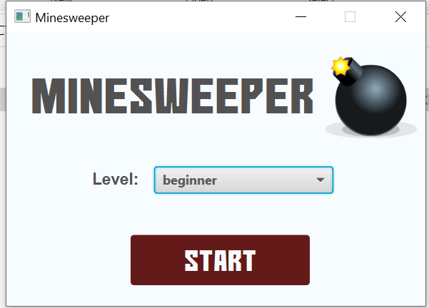

#ORBAN'S MINESWEEPER PROJECT

The objective of this game/application is to clear a board containing hidden “mines” or bombs without detonating any of them, with help from clues about the number of neighboring mines in each field.

To play the game, you need to choose from the board (beginner, intermediate, or expert) options. it is advicable to start as a beginer then progress accordingly. players may select to replay a board, in which the game is played by revealing squares of the grid by clicking or otherwise indicating each square. If a square containing a mine is revealed, the player loses the game. If no mine is revealed, a digit is instead displayed in the square, indicating how many adjacent squares contain mines; if no mines are adjacent, the square becomes blank, and all adjacent squares will be recursively revealed. The player uses this information to deduce the contents of other squares and may either safely reveal each square or mark the square as containing a mine.

#STARTING THE APPLICATION:

To start the Game/application, right-click on the Main Class and the select the Run 'Main-main()' and the Game main board will display on your desktop, thereafter, set the height, the width and the number of mines according to your preferred size of the rectangular game board, which also shows how simple or hard the game will be. the more the number of mines reset, the difficult  the game is to win.

LICENSE

COPYRIGHT © 2022 ORBANJAMES.
